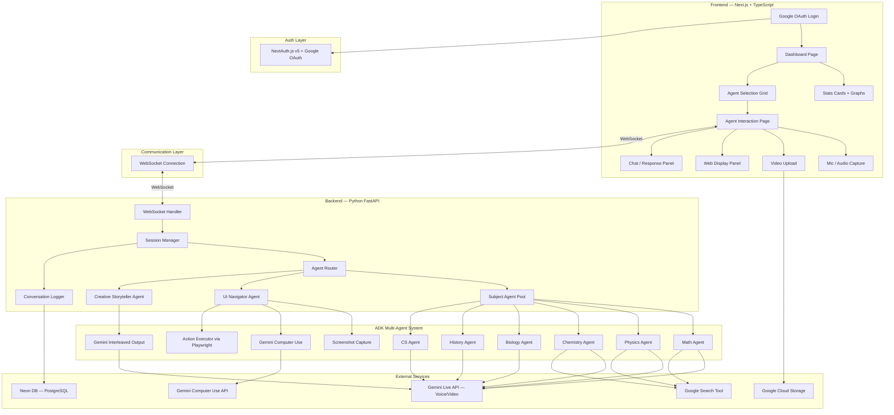
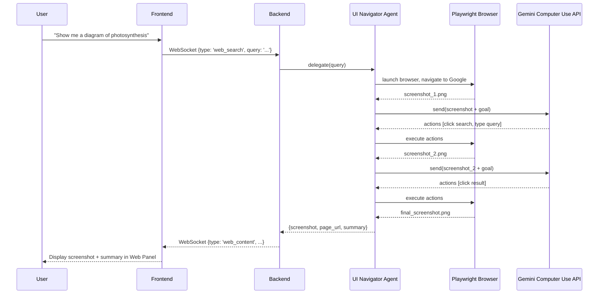
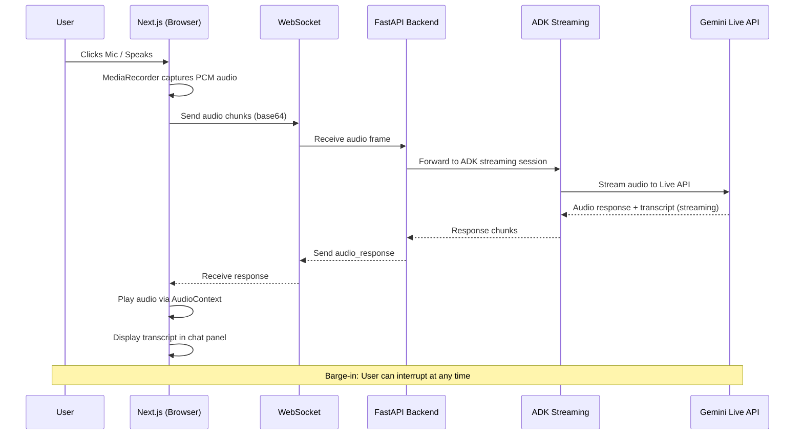
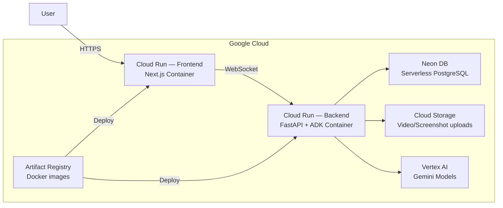

# Subject Matter Expert (SME) — Multimodal Agent Platform

## Architecture Plan for the Gemini Live Agent Challenge

This document outlines the complete architecture for a **Subject Matter Expert (SME)** platform — a multi-agent system where users select a subject-specific AI agent and interact with it via voice, video, and text in real-time. The platform covers all three challenge categories: **Live Agents**, **Creative Storyteller**, and **UI Navigator**.

---

## High-Level Architecture



---

## Technology Stack

| Layer | Technology | Purpose |
|-------|-----------|---------|
| **Frontend** | Next.js 14+ (App Router), TypeScript | Dashboard, Agent UI, WebSocket client |
| **Auth** | NextAuth.js v5 (`next-auth@beta`) + Google OAuth | User authentication & session management |
| **Styling** | Vanilla CSS with CSS Variables | Premium dark-mode design system |
| **Backend** | Python 3.11+, FastAPI | WebSocket server, agent orchestration |
| **Agent Framework** | Google ADK (`google-adk`) | Multi-agent system, Live API streaming |
| **LLM** | `gemini-live-2.5-flash-native-audio` | Real-time voice, multimodal reasoning |
| **Image Gen** | `gemini-2.5-flash` (interleaved output) | Creative Storyteller text+image generation |
| **UI Navigation** | Gemini Computer Use model + Playwright | Screenshot-driven browser automation |
| **Database** | Neon DB (serverless PostgreSQL) | Conversation storage, auth, user sessions |
| **ORM** | Drizzle ORM (frontend) + SQLAlchemy (backend) | Type-safe DB access |
| **Cloud** | Google Cloud Run, Artifact Registry | Containerized deployment |
| **Storage** | Google Cloud Storage | Video uploads, screenshots |

---

## System Components — Detailed Breakdown

### 1. Next.js Frontend

#### Pages

| Route | Description |
|-------|-------------|
| `/` | Landing / Dashboard — stats cards + agent grid |
| `/agent/[slug]` | Agent interaction page with voice, video, web-display panels |
| `/history` | Past conversation browser (from Neon DB) |
| `/api/auth/[...nextauth]` | NextAuth.js API route (Google OAuth) |
| `/login` | Login page with Google sign-in button |

#### Authentication (NextAuth.js v5 + Google OAuth)

All routes except `/login` are protected. Users must sign in with Google to access the dashboard and agents.

**Key files:**

```typescript
// src/auth.ts — NextAuth configuration
import NextAuth from "next-auth";
import Google from "next-auth/providers/google";
import { DrizzleAdapter } from "@auth/drizzle-adapter";
import { db } from "@/drizzle/db";

export const { handlers, auth, signIn, signOut } = NextAuth({
  adapter: DrizzleAdapter(db),  // Persists users/sessions to Neon DB
  providers: [
    Google({
      clientId: process.env.GOOGLE_CLIENT_ID!,
      clientSecret: process.env.GOOGLE_CLIENT_SECRET!,
    }),
  ],
  pages: { signIn: "/login" },
  callbacks: {
    session({ session, user }) {
      session.user.id = user.id;  // Expose user ID in session
      return session;
    },
  },
});
```

```typescript
// middleware.ts — Protect all routes except login & API auth
import { auth } from "@/auth";

export default auth((req) => {
  if (!req.auth && req.nextUrl.pathname !== "/login") {
    return Response.redirect(new URL("/login", req.url));
  }
});

export const config = { matcher: ["/((?!api/auth|_next|icons|favicon).*)"] };
```

#### Key Frontend Features

- **Dashboard**:
  - **Stats Cards row**: Glassmorphism cards showing Total Sessions, Total Messages, Avg Session Duration, Favorite Agent — with animated counters and mini sparkline graphs
  - **Usage Graph**: A `<canvas>`-based line chart showing sessions per day over the last 30 days (rendered with lightweight chart lib or raw Canvas API)
  - **Agent Grid**: Animated agent cards (Math, Physics, Chemistry, CS, Biology, History, **Creative Storyteller**) each with icon, description, and "Start Session" CTA
- **Agent Interaction Page**:
  - **Mic Button**: Uses `MediaRecorder` API → captures PCM audio → streams via WebSocket to backend
  - **Video Upload**: File picker or drag-drop → uploads to GCS → sends URL to agent via WebSocket
  - **Response Panel**: Displays the agent's spoken response as text + plays audio response via `AudioContext`. For Creative Storyteller, renders interleaved text + generated images inline
  - **Web Display Panel**: An embedded `<iframe>` or screenshot viewer that shows web content when the agent fetches from the web (UI Navigator)
  - **Conversation Sidebar**: Scrollable chat log of the session

#### Dashboard Stats Card Component

```typescript
// components/StatsCard.tsx — pseudocode
interface StatsCardProps {
  title: string;           // e.g. "Total Sessions"
  value: number;           // e.g. 142
  change: number;          // e.g. +12% (vs last week)
  sparklineData: number[]; // Last 7 data points for mini graph
  icon: string;            // Emoji or SVG icon
}

// Renders a glassmorphism card with:
// - Icon + title in top row
// - Large animated counter (counting up on mount)
// - Green/red percentage change badge
// - Mini sparkline SVG graph at bottom
```

**Stats data fetched from backend API:**
```
GET /api/stats?userId={id}
→ { totalSessions, totalMessages, avgDuration, favoriteAgent, dailySessions[] }
```

#### WebSocket Client (Next.js)

```typescript
// Pseudocode for WebSocket client
const ws = new WebSocket(`wss://<backend>/ws/session/${agentSlug}`);

// Send audio chunks
mediaRecorder.ondataavailable = (e) => {
  ws.send(JSON.stringify({ type: 'audio', data: base64(e.data) }));
};

// Send video URL after upload
ws.send(JSON.stringify({ type: 'video_url', url: gcsUrl }));

// Send text query
ws.send(JSON.stringify({ type: 'text', content: userMessage }));

// Ask agent to show something from the web
ws.send(JSON.stringify({ type: 'web_search', query: 'show me Newton laws diagram' }));

// Receive responses
ws.onmessage = (event) => {
  const msg = JSON.parse(event.data);
  // msg.type: 'audio_response' | 'text_response' | 'web_content' | 'screenshot'
};
```

---

### 2. Python FastAPI Backend

#### Core Structure

```
backend/
├── main.py                    # FastAPI app, WebSocket routes
├── config.py                  # Env vars, Neon DB URL, GCP config
├── requirements.txt
├── Dockerfile
├── .env
├── agents/
│   ├── __init__.py
│   ├── router_agent.py        # Root agent that routes to sub-agents
│   ├── math_agent.py          # Subject: Mathematics
│   ├── physics_agent.py       # Subject: Physics
│   ├── chemistry_agent.py     # Subject: Chemistry
│   ├── biology_agent.py       # Subject: Biology
│   ├── history_agent.py       # Subject: History
│   ├── cs_agent.py            # Subject: Computer Science
│   ├── storyteller_agent.py   # Creative Storyteller (interleaved output)
│   └── ui_navigator_agent.py  # UI Navigator (Computer Use)
├── services/
│   ├── session_manager.py     # Manages WebSocket sessions
│   ├── audio_processor.py     # PCM audio encode/decode
│   ├── video_processor.py     # Video frame extraction
│   ├── web_navigator.py       # Playwright-based browser control
│   └── conversation_store.py  # Neon DB CRUD operations
├── models/
│   └── db_models.py           # SQLAlchemy models
└── utils/
    └── gcs_upload.py          # Google Cloud Storage helper
```

#### Agent Definition Pattern (ADK)

Each subject agent follows this pattern:

```python
# agents/math_agent.py
from google.adk.agents import Agent
from google.adk.tools import google_search

math_agent = Agent(
    name="math_expert",
    model="gemini-live-2.5-flash-native-audio",
    description="Expert mathematics tutor covering algebra, calculus, geometry, statistics.",
    instruction="""You are an expert mathematics tutor. You explain concepts clearly 
    with step-by-step solutions. When a student shows you their homework via video/image, 
    analyze it and provide detailed feedback. Use Google Search when you need to 
    reference formulas, theorems, or visual diagrams. Always be encouraging and patient.""",
    tools=[google_search]
)
```

#### Creative Storyteller Agent

This agent uses Gemini's **interleaved output** to generate mixed text + images in a single response, covering the **Creative Storyteller** challenge category.

```python
# agents/storyteller_agent.py
from google.adk.agents import Agent
from google.adk.tools import google_search

storyteller_agent = Agent(
    name="creative_storyteller",
    model="gemini-2.5-flash",  # Supports interleaved text+image output
    description="Creative storyteller that generates rich narratives with inline illustrations.",
    instruction="""You are a creative storyteller and visual narrator. When a user 
    gives you a topic or prompt, create an engaging story or educational explanation 
    that interleaves descriptive text with generated illustrations. Produce your 
    output as a mixed stream of text paragraphs and images. For educational topics, 
    weave diagrams and visual explanations into your narrative. Always make the 
    content visually rich and engaging.""",
    tools=[google_search],
    generate_content_config={
        "response_modalities": ["TEXT", "IMAGE"],  # Enable interleaved output
    }
)
```

**Frontend rendering**: The `ResponsePanel` detects interleaved chunks — text parts render as styled paragraphs, image parts render as inline `` tags with fade-in animations, creating a rich scrollable story experience.

#### Root Router Agent (Multi-Agent Routing)

```python
# agents/router_agent.py
from google.adk.agents import Agent
from agents.math_agent import math_agent
from agents.physics_agent import physics_agent
# ... import all subject agents
from agents.storyteller_agent import storyteller_agent
from agents.ui_navigator_agent import ui_navigator_agent

root_agent = Agent(
    name="sme_router",
    model="gemini-live-2.5-flash-native-audio",
    description="Routes user queries to the appropriate subject matter expert.",
    instruction="""You are the central coordinator. Based on the user's selected 
    subject or the content of their query, delegate to the appropriate specialist agent. 
    If the user asks to show something from the web, delegate to the UI Navigator agent.
    If the user wants a story, visual narrative, or creative content, delegate to the 
    Creative Storyteller agent.""",
    sub_agents=[
        math_agent, physics_agent, chemistry_agent,
        biology_agent, history_agent, cs_agent,
        storyteller_agent, ui_navigator_agent
    ]
)
```

#### WebSocket Handler (FastAPI)

```python
# main.py — pseudocode
@app.websocket("/ws/session/{agent_slug}")
async def websocket_endpoint(websocket: WebSocket, agent_slug: str):
    await websocket.accept()
    session = session_manager.create(agent_slug, websocket)
    
    # Initialize ADK streaming session with the selected agent
    adk_session = await create_adk_streaming_session(agent_slug)
    
    try:
        while True:
            data = await websocket.receive_json()
            
            if data["type"] == "audio":
                # Forward audio to Gemini Live API via ADK streaming
                audio_bytes = base64_decode(data["data"])
                response = await adk_session.send_audio(audio_bytes)
                await websocket.send_json({
                    "type": "audio_response",
                    "audio": base64_encode(response.audio),
                    "text": response.transcript
                })
                
            elif data["type"] == "video_url":
                # Process uploaded video
                response = await adk_session.send_video(data["url"])
                await websocket.send_json({
                    "type": "text_response",
                    "content": response.text
                })
                
            elif data["type"] == "web_search":
                # Delegate to UI Navigator agent
                result = await ui_navigator.navigate_and_capture(data["query"])
                await websocket.send_json({
                    "type": "web_content",
                    "screenshot": result.screenshot_url,
                    "summary": result.summary
                })
            
            # Log to Neon DB
            await conversation_store.log_turn(session.id, data, response)
            
    except WebSocketDisconnect:
        await session_manager.close(session)
```

---

### 3. UI Navigator Agent (Computer Use Model)

This fulfills the **UI Navigator** challenge category.



#### Implementation

```python
# services/web_navigator.py — pseudocode
from playwright.async_api import async_playwright
from google import genai

class WebNavigator:
    async def navigate_and_capture(self, query: str) -> NavigationResult:
        async with async_playwright() as p:
            browser = await p.chromium.launch()
            page = await browser.new_page()
            await page.goto("https://www.google.com")
            
            goal = f"Search for and find: {query}"
            
            for step in range(MAX_STEPS):
                screenshot = await page.screenshot()
                
                response = client.models.generate_content(
                    model="gemini-2.5-flash",  # Computer Use model
                    contents=[goal, screenshot],
                    config={"tools": [{"computer_use": {}}]}
                )
                
                for action in response.computer_use_actions:
                    await self.execute_action(page, action)
                
                if response.is_complete:
                    break
            
            final_screenshot = await page.screenshot()
            return NavigationResult(
                screenshot=final_screenshot,
                url=page.url,
                summary=response.text
            )
```

---

### 4. Database Schema (Neon DB)

Includes NextAuth.js adapter tables for auth and application tables for conversations/stats.

```sql
-- === NextAuth.js Required Tables ===
CREATE TABLE users (
    id UUID PRIMARY KEY DEFAULT gen_random_uuid(),
    name VARCHAR(255),
    email VARCHAR(255) UNIQUE,
    "emailVerified" TIMESTAMP,
    image VARCHAR(500),
    created_at TIMESTAMP DEFAULT NOW()
);

CREATE TABLE accounts (
    id UUID PRIMARY KEY DEFAULT gen_random_uuid(),
    "userId" UUID REFERENCES users(id) ON DELETE CASCADE,
    type VARCHAR(50) NOT NULL,
    provider VARCHAR(50) NOT NULL,
    "providerAccountId" VARCHAR(255) NOT NULL,
    refresh_token TEXT, access_token TEXT,
    expires_at INTEGER, token_type VARCHAR(50),
    scope TEXT, id_token TEXT,
    UNIQUE(provider, "providerAccountId")
);

CREATE TABLE sessions (
    id UUID PRIMARY KEY DEFAULT gen_random_uuid(),
    "sessionToken" VARCHAR(255) UNIQUE NOT NULL,
    "userId" UUID REFERENCES users(id) ON DELETE CASCADE,
    expires TIMESTAMP NOT NULL
);

-- === Application Tables ===
CREATE TABLE conversations (
    id UUID PRIMARY KEY DEFAULT gen_random_uuid(),
    user_id UUID REFERENCES users(id),
    agent_slug VARCHAR(50) NOT NULL,
    title VARCHAR(255),
    started_at TIMESTAMP DEFAULT NOW(),
    ended_at TIMESTAMP,
    metadata JSONB DEFAULT '{}'
);

CREATE TABLE messages (
    id UUID PRIMARY KEY DEFAULT gen_random_uuid(),
    conversation_id UUID REFERENCES conversations(id) ON DELETE CASCADE,
    role VARCHAR(20) NOT NULL,  -- 'user' | 'agent'
    content_type VARCHAR(20) NOT NULL,  -- 'text' | 'audio' | 'video' | 'image' | 'screenshot'
    content TEXT,
    audio_url VARCHAR(500),
    media_url VARCHAR(500),
    created_at TIMESTAMP DEFAULT NOW()
);

CREATE TABLE agent_configs (
    slug VARCHAR(50) PRIMARY KEY,
    display_name VARCHAR(100),
    description TEXT,
    icon_url VARCHAR(500),
    system_instruction TEXT,
    is_active BOOLEAN DEFAULT TRUE
);
```

---

### 5. Real-Time Audio/Video Flow



**Key Audio Specs:**
- Input: 16-bit PCM, 16kHz, mono
- Output: PCM at 24kHz
- Supports barge-in (interruption)
- 24+ language support

---

### 6. Deployment Architecture (Google Cloud)



**Deployment Steps:**
1. Build Docker images for frontend (Next.js) and backend (FastAPI + ADK)
2. Push to Google Artifact Registry
3. Deploy both to Cloud Run with `gcloud run deploy`
4. Backend uses `adk deploy cloud_run` for the ADK agent specifically
5. Set env vars: `GOOGLE_CLOUD_PROJECT`, `GOOGLE_CLOUD_LOCATION`, `NEON_DATABASE_URL`

---

## Project Structure (Full)

```
Subject Matter Expert/
├── frontend/                          # Next.js App
│   ├── package.json
│   ├── tsconfig.json
│   ├── next.config.js
│   ├── middleware.ts                  # Auth route protection
│   ├── Dockerfile
│   ├── .env.local
│   ├── public/
│   │   └── icons/                     # Agent icons
│   ├── src/
│   │   ├── auth.ts                    # NextAuth.js v5 config
│   │   ├── app/
│   │   │   ├── layout.tsx             # Root layout + SessionProvider
│   │   │   ├── page.tsx               # Dashboard (stats + agent grid)
│   │   │   ├── globals.css            # Design system
│   │   │   ├── login/
│   │   │   │   └── page.tsx           # Google sign-in page
│   │   │   ├── agent/
│   │   │   │   └── [slug]/
│   │   │   │       └── page.tsx       # Agent interaction page
│   │   │   ├── history/
│   │   │   │   └── page.tsx           # Conversation history
│   │   │   └── api/
│   │   │       ├── auth/[...nextauth]/
│   │   │       │   └── route.ts       # NextAuth API handler
│   │   │       └── stats/
│   │   │           └── route.ts       # Dashboard stats API
│   │   ├── components/
│   │   │   ├── AgentCard.tsx          # Dashboard agent card
│   │   │   ├── StatsCard.tsx          # Stats card with sparkline
│   │   │   ├── UsageChart.tsx         # Sessions-per-day line chart
│   │   │   ├── MicButton.tsx          # Audio capture button
│   │   │   ├── VideoUpload.tsx        # Video upload component
│   │   │   ├── ChatPanel.tsx          # Conversation log
│   │   │   ├── StoryRenderer.tsx      # Interleaved text+image renderer
│   │   │   ├── WebDisplayPanel.tsx    # Web content viewer
│   │   │   ├── AudioVisualizer.tsx    # Waveform animation
│   │   │   └── ResponseBubble.tsx     # Individual message
│   │   ├── hooks/
│   │   │   ├── useWebSocket.ts        # WebSocket connection hook
│   │   │   ├── useAudioCapture.ts     # Media recorder hook
│   │   │   └── useAudioPlayback.ts    # Audio response playback
│   │   ├── lib/
│   │   │   ├── websocket.ts           # WebSocket utility
│   │   │   └── api.ts                 # REST API client (history, stats)
│   │   └── types/
│   │       └── index.ts               # TypeScript type definitions
│   └── drizzle/
│       ├── schema.ts                  # Drizzle ORM schema (auth + app)
│       └── db.ts                      # Neon DB connection
│
├── backend/                           # Python FastAPI + ADK
│   ├── main.py                        # FastAPI app entry
│   ├── config.py                      # Environment config
│   ├── requirements.txt
│   ├── Dockerfile
│   ├── .env
│   ├── agents/
│   │   ├── __init__.py
│   │   ├── router_agent.py            # Root coordinator agent
│   │   ├── math_agent.py
│   │   ├── physics_agent.py
│   │   ├── chemistry_agent.py
│   │   ├── biology_agent.py
│   │   ├── history_agent.py
│   │   ├── cs_agent.py
│   │   ├── storyteller_agent.py       # Creative Storyteller agent
│   │   └── ui_navigator_agent.py      # Computer Use agent
│   ├── services/
│   │   ├── session_manager.py
│   │   ├── audio_processor.py
│   │   ├── video_processor.py
│   │   ├── web_navigator.py           # Playwright browser control
│   │   └── conversation_store.py
│   ├── models/
│   │   └── db_models.py               # SQLAlchemy models
│   ├── utils/
│   │   └── gcs_upload.py
│   └── tests/                         # Backend unit tests
│       ├── __init__.py
│       ├── conftest.py                # Shared fixtures (mock DB, mock WS)
│       ├── test_session_manager.py    # Session lifecycle tests
│       ├── test_conversation_store.py # Neon DB CRUD tests
│       ├── test_agent_routing.py      # Agent selection & delegation
│       ├── test_websocket_handler.py  # WebSocket message flow tests
│       ├── test_audio_processor.py    # PCM encode/decode tests
│       └── test_web_navigator.py      # UI Navigator mock tests
│
└── docker-compose.yml                 # Local development orchestration
```

---

## Prerequisites

> [!WARNING]
> **Google Cloud Project**: You need an active GCP project with billing enabled, Vertex AI API enabled, and Gemini models accessible.

> [!WARNING]
> **Google OAuth Credentials**: Create OAuth 2.0 credentials in [Google Cloud Console](https://console.cloud.google.com/apis/credentials) with `http://localhost:3000/api/auth/callback/google` as authorized redirect URI.

> [!WARNING]
> **Neon DB account**: Create a free Neon DB account at [neon.tech](https://neon.tech) and get your database connection string.

---

## Phased Implementation Roadmap

### Phase 1 — Foundation (Days 1–2)
1. Scaffold Next.js frontend with App Router
2. Set up NextAuth.js v5 with Google OAuth + Drizzle adapter
3. Set up Python FastAPI backend with basic WebSocket endpoint
4. Create design system (CSS variables, dark theme, typography)
5. Build login page with Google sign-in
6. Set up Neon DB schema (auth tables + app tables)

### Phase 2 — Dashboard & Agent System (Days 3–4)
7. Build dashboard with StatsCards, UsageChart, and agent selection grid
8. Define all subject agents (6 subjects + Creative Storyteller) using ADK `Agent` class
9. Implement root router agent with `sub_agents` for LLM-driven delegation
10. Wire WebSocket handler to ADK streaming sessions
11. Implement audio capture (frontend) → stream → response playback pipeline
12. Test voice interaction end-to-end with one agent

### Phase 3 — Multimodal Features (Days 5–6)
13. Implement Creative Storyteller agent with interleaved text+image output
14. Build StoryRenderer component for inline media display
15. Implement video upload to GCS + agent processing
16. Build UI Navigator agent with Playwright + Computer Use model
17. Build WebDisplayPanel to show web content/screenshots
18. Implement conversation logging to Neon DB
19. Build conversation history page + stats API

### Phase 4 — Polish & Deploy (Days 7–8)
20. Add micro-animations, audio visualizer, premium UI polish
21. Write backend unit tests (pytest)
22. Containerize both services with Docker
23. Deploy to Google Cloud Run
24. End-to-end testing + demo recording

---

## Verification Plan

### Automated Tests
- **Frontend type-checking**: `npx tsc --noEmit` to verify TypeScript correctness
- **Lint checks**: `npm run lint` for frontend, `ruff check .` for backend

### Backend Unit Tests

**Run command:** `cd backend && python -m pytest tests/ -v --asyncio-mode=auto`

**Dependencies (in `requirements.txt`):**
```
pytest
pytest-asyncio
httpx          # For FastAPI TestClient with WebSocket
unittest.mock  # stdlib, for mocking ADK/Gemini calls
```

**Test files and what they cover:**

| Test File | Tests | Mocking Strategy |
|-----------|-------|------------------|
| `conftest.py` | Shared fixtures: mock DB session, mock WebSocket, mock ADK client, test agent configs | Uses `@pytest.fixture` with SQLAlchemy in-memory SQLite |
| `test_session_manager.py` | Create session, retrieve session, close session, concurrent sessions, session timeout cleanup | Mock WebSocket objects |
| `test_conversation_store.py` | Create conversation, log messages, fetch history, delete conversation, pagination | In-memory SQLite via fixture |
| `test_agent_routing.py` | Correct agent selected by slug, fallback on unknown slug, all 6 agents loadable, router agent has correct sub-agents | Mock ADK Agent instantiation |
| `test_websocket_handler.py` | Audio message routing, video URL routing, web_search routing, invalid message type handling, WebSocket disconnect cleanup | Mock ADK streaming session + mock WebSocket |
| `test_audio_processor.py` | Base64 encode/decode roundtrip, PCM format validation (16-bit, 16kHz, mono), empty audio handling, oversized chunk rejection | No external mocks needed |
| `test_web_navigator.py` | Navigation goal parsing, screenshot capture, action execution loop, max steps limit, error handling on page load failure | Mock Playwright page + mock Gemini Computer Use API response |

**Example test — `test_session_manager.py`:**

```python
import pytest
from unittest.mock import AsyncMock, MagicMock
from services.session_manager import SessionManager

@pytest.fixture
def session_manager():
    return SessionManager()

@pytest.fixture
def mock_websocket():
    ws = AsyncMock()
    ws.client_state = 1  # CONNECTED
    return ws

@pytest.mark.asyncio
async def test_create_session(session_manager, mock_websocket):
    session = session_manager.create("math", mock_websocket)
    assert session.agent_slug == "math"
    assert session.id is not None
    assert session_manager.get(session.id) is not None

@pytest.mark.asyncio
async def test_close_session(session_manager, mock_websocket):
    session = session_manager.create("physics", mock_websocket)
    await session_manager.close(session)
    assert session_manager.get(session.id) is None

@pytest.mark.asyncio
async def test_concurrent_sessions(session_manager):
    ws1, ws2 = AsyncMock(), AsyncMock()
    s1 = session_manager.create("math", ws1)
    s2 = session_manager.create("physics", ws2)
    assert s1.id != s2.id
    assert len(session_manager.active_sessions) == 2
```

**Example test — `test_agent_routing.py`:**

```python
import pytest
from unittest.mock import patch, MagicMock

def test_all_subject_agents_registered():
    from agents.router_agent import root_agent
    agent_names = [a.name for a in root_agent.sub_agents]
    expected = [
        "math_expert", "physics_expert", "chemistry_expert",
        "biology_expert", "history_expert", "cs_expert",
        "ui_navigator"
    ]
    for name in expected:
        assert name in agent_names, f"Missing agent: {name}"

def test_agent_selection_by_slug():
    from agents.router_agent import get_agent_by_slug
    assert get_agent_by_slug("math").name == "math_expert"
    assert get_agent_by_slug("physics").name == "physics_expert"

def test_unknown_slug_returns_fallback():
    from agents.router_agent import get_agent_by_slug
    fallback = get_agent_by_slug("nonexistent")
    assert fallback.name == "sme_router"  # Falls back to root
```

**Example test — `test_websocket_handler.py`:**

```python
import pytest
from unittest.mock import AsyncMock, patch
from httpx import ASGITransport, AsyncClient
from main import app

@pytest.mark.asyncio
async def test_audio_message_routed_to_adk():
    mock_adk = AsyncMock()
    mock_adk.send_audio.return_value = MagicMock(
        audio=b"response_audio", transcript="Hello"
    )
    with patch("main.create_adk_streaming_session", return_value=mock_adk):
        async with AsyncClient(
            transport=ASGITransport(app=app), base_url="http://test"
        ) as client:
            async with client.websocket_connect("/ws/session/math") as ws:
                await ws.send_json({"type": "audio", "data": "base64audio"})
                response = await ws.receive_json()
                assert response["type"] == "audio_response"
                assert response["text"] == "Hello"
                mock_adk.send_audio.assert_called_once()

@pytest.mark.asyncio
async def test_invalid_message_type_returns_error():
    mock_adk = AsyncMock()
    with patch("main.create_adk_streaming_session", return_value=mock_adk):
        async with AsyncClient(
            transport=ASGITransport(app=app), base_url="http://test"
        ) as client:
            async with client.websocket_connect("/ws/session/math") as ws:
                await ws.send_json({"type": "unknown_type"})
                response = await ws.receive_json()
                assert response["type"] == "error"
```

### Browser-Based Verification
1. **Dashboard rendering**: Open `http://localhost:3000`, verify all 6 agent cards render with correct labels and icons
2. **Agent selection**: Click an agent card → verify redirect to `/agent/<slug>` with correct agent name in the header
3. **WebSocket connection**: Open browser DevTools Network tab → verify WebSocket connection established on agent page load
4. **Voice interaction**: Click mic → speak → verify audio sent via WebSocket → verify response audio plays back and transcript appears in chat panel
5. **Video upload**: Upload a video file → verify upload progress → verify agent responds with analysis
6. **Web display**: Ask agent "show me a diagram of X" → verify screenshot/web content appears in the Web Display Panel
7. **Conversation history**: Navigate to `/history` → verify past sessions listed with timestamps and agent names

### Manual Verification (User)
- Deploy to Cloud Run and verify it works over HTTPS with real Gemini API keys
- Test barge-in (interrupting the agent mid-response) to verify graceful handling
- Test multiple subject agents to verify routing accuracy
